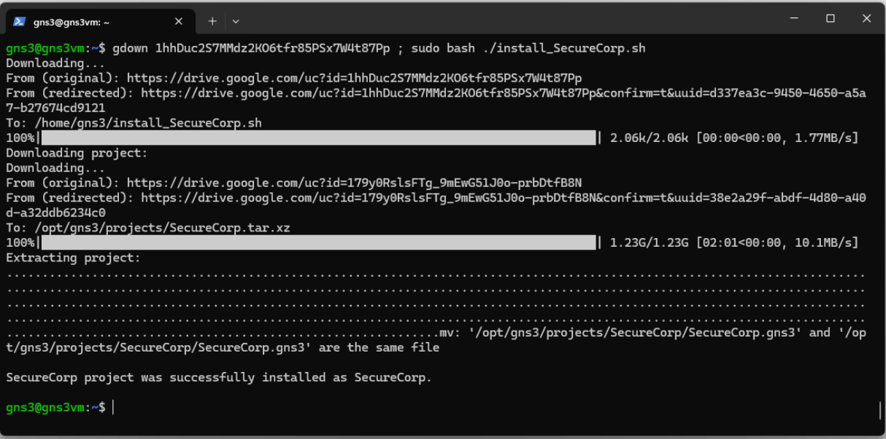

# Appendix

## Accessing GNS3 VM Shell

You will need to access the shell of the GNS3 VM for various tasks throughout the unit. To access the shell, first SSH into the VM using the below command on Windows Terminal or MacOS Terminal (Password: `gns3`).

```bash
ssh gns3@<gns3_VM_IP_address>
# For example
ssh gns3@192.168.20.128
```

Always SSH into the VM before accessing the Shell. You cannot copy and paste text directly into the VMWare console. Follow the instructions below to access the Shell.

<p align="center">
    
</p>
<p align="center">
    Fig3. Select OK
</p>


<p align="center">
    
</p>
<p align="center">
    Fig4. Select Shell
</p>