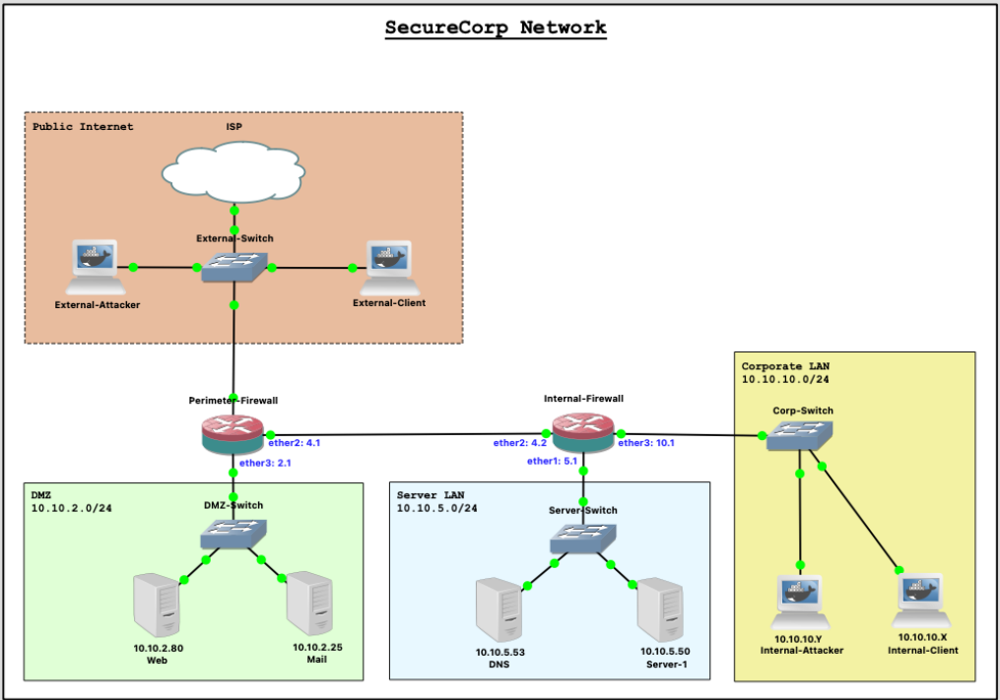

# About GNS 3

## 1. Adding a new GNS3 Project
> Through out the unit we will provide various different projects for you to work on. In this week we will be working on the SecureCorp project.

### 1.1 Download SecureCorp Project

Connect to the Shell of the VM via your host operating system’s Terminal. Please refer to the [Appendix](./appendix.md#accessing-gns3-vm-shell) section at the end of this document for instructions on how to access the terminal. Once you connect to the VM Shell, run the below command (one command) on the VM Shell to download and install the SecureCorp project. This will take a few minutes to complete depending on your internet speed. 
```bash
gdown 1hhDuc2S7MMdz2KO6tfr85PSx7W4t87Pp ; sudo bash ./install_SecureCorp.sh
```
<p align="center">
    
</p>
<p align="center">
    Fig1. Download SecureCorp project from VM Shell
</p>


> **NOTE**: If you encounter any error about the SecureCorp download, try to use your personal hotspot instead of Monash Wifi

### 1.2 Open SecureCorp Project
Once the project is installed, Open GNS3 and from the File menu, Select Open project > Go to Project library tab -> Select SecureCorp project. 

You can now start the project (i.e., all nodes) by clicking the green Play button. To open a console of a node, simply double-click it.

## 2. Using GNS3

Using GNS3 we can emulate real hardware devices. All the devices in SecureCorp network have real operating systems loaded in them. You can double-click on any of the devices to access the console to execute commands.

The workstations/servers in the project are Ubuntu docker containers and the routers are Mikrotik routers running RouterOS and switches are generic switches.

<p align="center">
    
</p>
<p align="center">
    Fig2. SecureCorp network topology
</p>

The containers only have the most essential tools installed on them. We will install relevant applications as we progress in the labs. Familiarize yourself with GNS3 and the SecureCorp network, the topology is self explanatory, however if you have any questions, please ask your tutors or post on the the Ed forum.

## 3. Docker

Docker is an open source containerization platform. Containers simplify delivery of distributed applications and are made possible by process isolation and virtualization capabilities built into the Linux kernel. We use Docker containers as light-weight virtual machines in GNS3 networks.