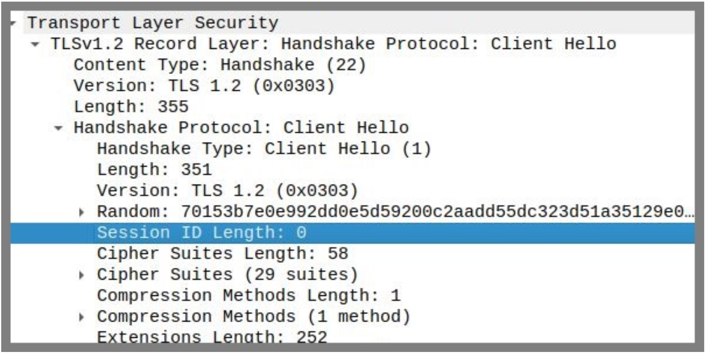

# 2. Transport Layer Security

The latest version of the Transport Layer Security (TLS) protocol is `TLS 1.3`, standardised in August 2018 under `RFC 8446`. Both `TLS 1.2` and `TLS 1.3` are currently considered secure for general communications when configured with strong cipher suites. While `TLS 1.3` offers improved performance, stronger default security, and reduced handshake complexity, `TLS 1.2` remains the most widely deployed version on the internet today due to its broad compatibility with existing systems. 

In this lab, we will use OpenSSL to carry out all tasks. OpenSSL is an open-source software library that provides the tools and libraries needed to implement SSL (Secure Sockets Layer) and TLS (Transport Layer Security) protocols. It also includes a command-line utility (openssl) for testing TLS connections, managing certificates, and performing various cryptographic operations.

---

## 2.1 TLS v1.2
A TLS handshake occurs whenever a user accesses a website over HTTPS. This process involves multiple steps in which the client and server exchange the information needed to complete the handshake and establish secure communication. In this task, we will capture a TLS 1.2 handshake using Wireshark and analyze the details of the connection establishment.

Open SecureCorp network configuration in GNS3 and start all nodes. You can use one of the nodes you added in the previous labs to perform the lab tasks. (ex: `Internal-Server`, `CA`, `Internal-Client-2`)

### 2.1.1 Initiate a TLS 1.2 Handshake with OpenSSL
Start packet capture on the link between the node you are using to run the commands and the network Switch it is connected to. Then run the below command on your chosen node to initiate a TLS handshake with Monash web server over `TLS 1.2`:
```bash
openssl s_client -connect monash.edu:443 -tls1_2
```

Wireshark should have captured the `TLS 1.2` handshake traffic. You should see the final packet of TLS handshake in Wireshark which is the ChangeCipherSpec message. Now that the TLS handshake is established, request the webpage over TLS from Monash webserver using the below command.

> **NOTE**: You must run the command below within 10 seconds of establishing the handshake; otherwise, the handshake will expire. If it does expire, run the previous command again to re-establish it.

```bash
GET / HTTP/1.1
Host: monash.edu
```
After running the above command, you should see Application Data packets being transmitted over TLS in Wireshark.


### 2.1.2 Client Hello
Open Wireshark and find ”Client Hello” packet. TLS wraps all traffic in “records” of different types. We see that the first byte out of our browser is the hex byte `0x16 = 22` which means that this is a “handshake” record:

<p align="center">
    
</p>
<p align="center">
    Fig6. Client Hello
</p>

In modern TLS handshakes, the legacy Version field is **largely ignored**, and supported TLS versions are communicated through the supported versions extension, found further down in the TLS header. You may see the version field set to `TLS 1.0` or `TLS 1.1`, even though the actual negotiated version is `TLS 1.2`.

<p align="center">
    
</p>
<p align="center">
    Fig7. Supported Version
</p>

The next two bytes are `0x0303` which indicate that this is a version 3.3 record which shows that `TLS 1.2` is essentially SSL 3.3. The handshake record is broken out into several messages. The first is our “Client Hello” message (`0x01`). There are a few important things here:

#### 1. Random
There are four bytes representing the current Coordinated Universal Time (UTC) in the Unix epoch format, which is the number of seconds since January 1, 1970. In this case, `0x70153b7e`.
It's followed by 28 random bytes. This will be used later on.
<p align="center">
    
</p>
<p align="center">
    Fig8. Random
</p>

#### 2. Cipher Suites
This is a list of all of the encryption algorithms that the browser is willing to support. Its top pick is a very strong choice of `TLS AES 256 GCM SHA384` followed by 28 others that it's willing to accept.

<p align="center">
    
</p>
<p align="center">
    Fig9. Cipher Suites
</p>


#### 3. server name extension
This is a way to tell monash.edu that our browser is trying to reach [https://www.monash.edu](https://www.monash.edu). This is really convenient because our TLS handshake occurs long before any HTTP traffic. HTTP has a “Host” header which allows hosting companies to host hundreds of websites onto a single IP address. SSL has traditionally required a different IP for each site, but this extension allows the server to respond with the appropriate certificate that the browser is looking for.

<p align="center">
    
</p>
<p align="center">
    Fig10. server name extension
</p>


#### 4. Session ID
Here it's `empty/null`. If we had previously connected to Monash a few seconds ago, we could potentially resume a session and avoid a full handshake.

<p align="center">
    
</p>
<p align="center">
    Fig11. Session ID
</p>

---

### 2.1.3 Server Hello

Monash replies with a handshake record. The record has version bytes of 0x0303 meaning that Monash agreed to our request to use TLS 1.2. This record has three sub-messages with some interesting data:

#### 1. “Server Hello” Message (2)
<p align="center">
    
</p>
<p align="center">
    Fig12. Server Hello
</p>

Of 29 cipher suites we o!ered, Monash didn't pick our first choice, instaed o!ered to use TLS ECDHE RSA WITH AES 128 GCM SHA256. So we will be using:
- ECDHE: Key exchange with Ephemeral Elliptic Curve Di”e-Hellman
- RSA: Server authentication with RSA signature (Rivest–Shamir–Adleman). **Note**: Not to confuse with RSA based key-exchange.
- AES 128: Symmetric-Key encryption algorithm. 128-bit Encryption with Advanced Encryption Standard. Once the handshake is complete, both sides use the agreed symmetric key to encrypt and decrypt application data.
- GCM: AES Mode of Operation with Galois/Counter Mode (GCM)
- SHA256: The SHA-256 hash function is used during handshake key derivation and in GCM's authentication tag generation, helping derive strong session keys from the ECDHE shared secret and ensuring data integrity.

#### 2. Certificate Message

The ”Server Hello” is not yet done. Find ”Certificate” packet which is also part of TLS handshake.

> **Note**: In Wireshark, you may see the ServerHello, Certificate, and ServerKeyExchange messages grouped together within a single TCP packet. This does not mean they are merged into one TLS handshake step — they remain separate handshake messages with distinct type codes. In the TLS details pane, you should still see multiple handshake messages listed within that combined packet.

<p align="center">
    
</p>
<p align="center">
    Fig13. Certificate
</p>

Notice that the certificate size is `3543` bytes, but the packet size is `1474` bytes. The certificate is taking more than one packet and Wireshark is showing us the certificate after re-assembling TCP segments (3 segments in this case).

#### 3. Certificate Status

Locate the “Certificate Status” packet. This message contains a dated, signed OCSP (Online Certificate Status Protocol) response indicating whether the server's `X.509` certificate is revoked. In OCSP stapling, the client requests the server to include this response in the TLS handshake, avoiding direct OCSP queries by the client. This reduces bandwidth usage and prevents OCSP servers from being overloaded with client requests.

> **Note**: The client must indicate support for OCSP stapling by including the status request extension in the TLS ClientHello. If the client does not request it, or the server does not support it, you will not see this message in Wireshark.

<p align="center">
    
</p>
<p align="center">
    Fig14. Certificate Status
</p>

#### 4. Server Key Exchange

After ServerHello, you'll see a ServerKeyExchange message. This is sign that ECDHE is in use. (RSA-only key exchange skips this message as the client can encrypt the premaster secret directly to the server's RSA public key from its certificate, so no extra parameters are required).

When ECDHE is used, the ServerKeyExchange message includes the elliptic curve parameters (typically sent as a named curve), the server's ephemeral ECDH public key generated for that handshake, and a digital signature over the client and server random values along with the ECDHE parameters, signed using the server's certificate key to prove authenticity. 

> Note that the signature algorithm used here is RSA, as specified by the negotiated cipher suite.

<p align="center">
    
</p>
<p align="center">
    Fig15. Server Key Exchange
</p>

#### 5. Server Hello Done

This is a zero byte message that tells the client that it's done with the “Hello” process and indicate that the server won't be asking the client for a certificate.

<p align="center">
    
</p>
<p align="center">
    Fig16. Server Hello Done
</p>

The browser will verify the Certificate Authority's signature on the server's certificate, and if all goes well it will continue to the next step, otherwise the browser will complain about the validity of the certificate and let the user decide if they still want to continue.

#### Client response to server
Find “Client Key Exchange, Change Cipher Spec, Encrypted Handshake Message” packet. 

**1. Client Key Exchange**

The ClientKeyExchange message contains the client's ephemeral public key, using the same curve specified by the server in the ServerKeyExchange message. No signature is included, as the client does not authenticate itself here unless mutual authentication is configured, which occurs as a separate step in the handshake.

<p align="center">
    
</p>
<p align="center">
    Fig17. Client Response
</p>


**2. Change Cipher Spec**

This message notifies the server that all the future messages will be encrypted using the algorithm and keys that were just negotiated.

**3. Finished (Encrypted Handshake)**

The Finished message is complicated as it is a hash of all the messages exchanged previously along with a label (“client finished”). This message indicates that the TLS negotiation is completed for the client.

#### Pre-master Secret
Now that both sides have their own ephemeral private key and the other party's ephemeral public key, they can use the Elliptic Curve Diffie–Hellman (ECDH) algorithm to compute the same shared secret.

If RSA key-exchange was used the client generates the premaster secret directly (using random bytes) and encrypts it with the server's RSA public key and send over the wire to the server.

#### Master Secret
To create the master secret, the premaster secret, client random, and server random are fed into the TLS pseudorandom function (PRF), which produces the master secret and, ultimately, the symmetric session keys.

#### Server response to Client
The server informs the client that the messages will be encrypted with the existing algorithms and keys. The record layer now changes its state to use the symmetric key encryption.

<p align="center">
    
</p>
<p align="center">
    Fig18. Server Response
</p>

#### Application Data Flow

The master secret will be used for generating encryption keys (AES_GCM as agreed by both parties), MAC secrets, and IVs. The key generation algorithms are not the scope of this lab, refer to the RFC 5246 (https://datatracker.ietf.org/doc/html/rfc5246/) for more details.

Once the entire TLS Handshake is successfully completed and the peers validated, the applications on the peers can begin communicating with each other.

<p align="center">
    
</p>
<p align="center">
    Fig19. Encrypted Application Data
</p>

---

## 2.2 RSA Key-Exchange
Industry best practices (e.g., RFC 7525) recommend using ECDHE over RSA key exchange precisely because of its forward secrecy and stronger resilience against long-term key compromise.

In the RSA method, the premaster secret is encrypted with the server's public key and sent over the network; if intercepted and the server's private key is later compromised, an attacker can decrypt it. With ECDHE, the premaster secret is never transmitted. It is independently computed by the client and server via the ECDH algorithm, and an attacker would need both ephemeral private keys to reconstruct it.

> **Optional Task**: Use the command below to connect to a server using the RSA key exchange method, then compare the TLS handshake messages in Wireshark with those from the previous task. Support for the RSA method is disabled on most servers; this particular server has been intentionally configured to be vulnerable for educational purposes.
```bash
openssl s_client -connect static-rsa.badssl.com:443 -cipher -tls1_2
```

---

## 2.3 TLS 1.3

TLS 1.3 is faster and more secure than TLS 1.2 because it removes outdated cryptography, enforces forward secrecy, and reduces the handshake to a single round trip (with optional 0-RTT for resumed sessions). It supports only modern AEAD ciphers such as AES-GCM and ChaCha20-Poly1305, encrypts more of the handshake for improved privacy, and simplifies negotiation by eliminating legacy algorithms and features.

Now, let's examine the TLS 1.3 handshake to see if we can identify the above mentioned differences compared to TLS 1.2. The below command enforce the Monash web server to use TLS 1.3.
```bash
openssl s_client -connect monash.edu:443 -tls1_3
```

---

## 2.4 TLS 1.0/1.1

In March 2021 IETF officially deprecated TLS 1.0 and TLS 1.1. TLS 1.0 was released in 1999, making it a nearly two-decade-old protocol. It has been known to be vulnerable to attacks—such as BEAST and POODLE, in addition to supporting weak cryptography, which doesn't keep modern-day connections sufficiently secure.

TLS 1.1 doesn't have any known protocol vulnerabilities, though it does share support for bad cryptography like TLS1.0.

According to Shodan search engine thousands of website around the world still use TLS1.0/1.1. Click [here](https://beta.shodan.io/search/report?query=http%20ssl.version%3Atlsv1.0%2Ctlsv1.1&title=TLS%201.0/%201.1%20Usage%20Report) to see the Shodan search results. 

Now let's try to connect to Monash web-server using TLS 1.1. OpenSSL version installed on your Ubuntu 24.04 containers does not support TLS 1.0 or TLS 1.1 versions. Let's first enable those TLS versions in OpenSSL. 
```bash
nano /etc/ssl/openssl1.cnf
```

1. Create a new file named openssl1.cnf using the above command and copy the below configurations in to that file. These configurations will set the minimum TLS protocol to TLS1.0. Save and exit by pressing `ctrl + X`.

```bash
openssl_conf = default_conf
[default_conf]
ssl_conf = ssl_sect
[ssl_sect]
system_default = ssl_default_sect
[ssl_default_sect]
MinProtocol = TLSv1
CipherString = DEFAULT:@SECLEVEL=1
```

2. Now run the below command to force OpenSSL to use the configuration file we just created.
```bash
export OPENSSL_CONF=/etc/ssl/openssl1.cnf
    
# Now use the below command to connect to Monash web-server using TLS1.1 protocol:
openssl s_client -connect monash.edu:443 -tls1_1

# Notice that Monash did not perform handshake with us. Now let's try a website which supports TLS1.1.:
openssl s_client -connect tls-v1-1.badssl.com:1011 -tls1_1
```

> **Note**: [badssl.com](https://badssl.com) is a website intentionally made vulnerable for educational purposes.

Analyse the handshake traffic in Wireshark and compare it with TLS1.2 (especially compare the cipher suites).